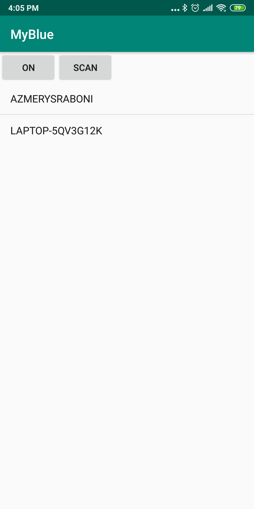

# MyBlue
Bluetooth applicatin. Turns on the blutooth and show available devices.

User need to manually go to settings and give the location permission. Otherwise, no available devices will show.

The app has started. Bluetooth is turned off. No bluetooth icon showing in notification bar.

Asking permission to turn on bluetooth.

Bluetooth has turned on. Showing the bluetooth icon in notification bar.

Showing the available devices in a list.

